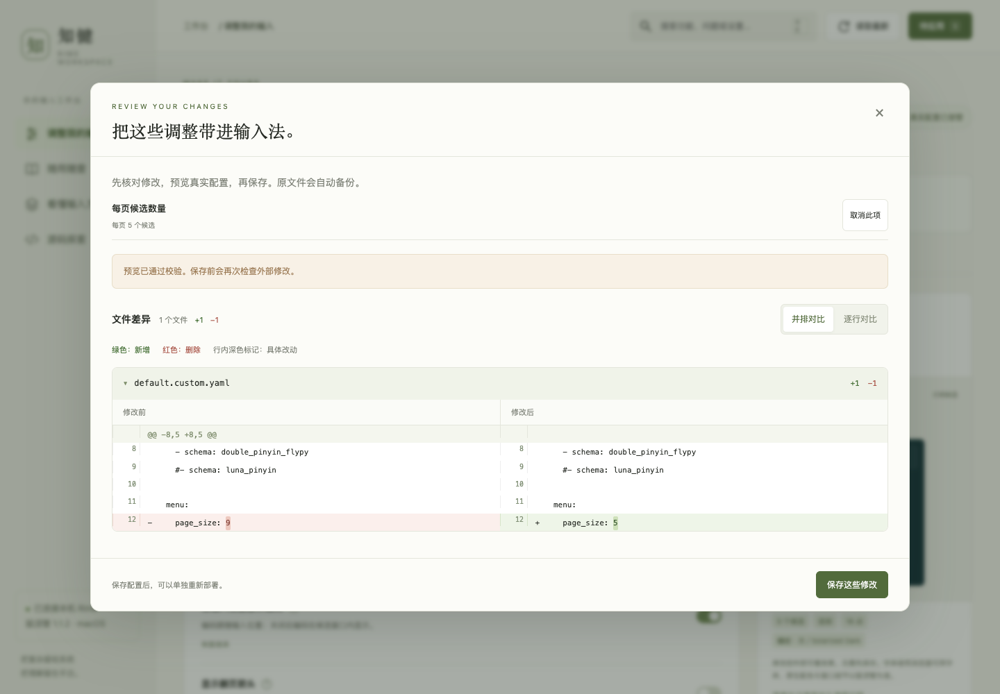

# 知键 · Rime Studio

一个把 **Rime 配置修改器、使用指南和方案探索** 放在一起的本地 Web 工作台。

希望改变候选窗口，不必记 YAML 路径；忘了外国人名中间的 `·` 怎么输入，可以按描述查按键；想理解输入法为什么这样工作，可以顺着配置、组件和源码往下探索。

运行时不使用 AI、不调用云端 API、不依赖 CDN。面向 **macOS 鼠须管（Squirrel）**，目前是可运行的早期版本。


## 快速开始

需要：

- macOS，已经安装并使用鼠须管。
- 已存在的 Rime 用户目录 `~/Library/Rime`。
- Node.js 22 或以上；目前验证使用 Node.js 24。
- npm。首次安装依赖需要联网，运行后使用本机服务。

```bash
git clone https://github.com/codepiano/rime-studio.git
cd rime-studio
npm ci
npm start
```

打开 **<http://127.0.0.1:4319>**。

也可以双击根目录的 **`启动知键.command`**。启动器会检查已有服务，必要时安装依赖、启动服务并打开浏览器。首次打开 `.command` 若被系统拦截，可以使用终端启动。

服务只监听 `127.0.0.1`。默认读取：

```text
用户配置：~/Library/Rime
内置配置：/Library/Input Methods/Squirrel.app/Contents/SharedSupport
```

改变控件会加入待应用清单，**不会立即写入配置**。请先生成文件差异预览，再保存，最后重新部署。

## 可以做什么

| 入口 | 用途 |
| --- | --- |
| 调整我的输入 | 候选数、排列、字体、配色、Shift 行为、菜单按键、方案默认状态、词库学习、应用语言规则、半角标点、方案启停与排序 |
| 随用随查 | 26 张操作卡，按问题组织，支持搜索、收藏、跳转设置与教学练习 |
| 找符号 | 用“外国人名”“圆点”“省略号”等描述，或粘贴字符，查询所选方案已部署的真实按键映射 |
| 看懂输入方案 | 查看真实方案的按键处理、分段、候选生成、过滤组件及拼写规则；目前只读 |
| 源码探索 | 查阅固定提交的 Squirrel、librime、plum 和 Rime Wiki 调研快照 |

### 修改之前，看清文件差异

待应用清单连接真实配置文件。文件差异使用本机加载的 jsdiff / diff2html，支持并排、逐行、行号、增删统计、行内高亮与新增文件提示。



### 忘了符号的输入方法，就按描述查

“找符号”读取所选方案已有的编译配置，区分直接输出、候选选择与配对引号，并优先推荐简单的输入方式。不同方案、标点模式和键盘布局可能不同。


## 保存、部署与恢复

1. 调整控件，修改进入待应用清单。
2. 生成预览，核对真实文件差异。
3. 保存修改；系统自动保存修改前的完整配置文本。
4. 请求鼠须管重新部署，再在真实输入框里确认效果。

只修改 `default.custom.yaml`、`squirrel.custom.yaml` 和已安装方案的 `.custom.yaml`。保留原有注释及不相关设置，不编辑原始方案定义、词典或用户学习数据库。

备份在 `.data/backups/`。恢复之前检查文件是否又被修改，避免直接覆盖后续修改。首次创建的文件可以恢复为不存在。

“保存成功”“部署请求已发送”“编译产物已更新”是不同状态。后台重载通知可能延迟；未能确认时，请从系统输入法菜单手动重新部署。编译时间检查不等于运行时行为验收。

## 当前范围

- 目前只支持 macOS 鼠须管，未支持 Windows 小狼毫和 Linux 客户端。
- 常见根级继承和补丁路径可读写，不能替代完整 Rime 配置编译器。无法安全合并的高级补丁会拒绝修改。
- 候选外观预览使用示例数据，只近似呈现外观；原生配色和真实窗口以鼠须管为准。
- 教学练习不运行 Rime 引擎，也不操作真实词库。
- 尚未实现新方案下载、词库编辑、短语表编辑、模糊音规则编辑、插件安装或源码构建。
- 默认语言、字形设置对应新会话；已有状态还可能受到 `save_options` 等机制影响。
- 社区讨论与配方是探索线索，不代表已在本机安装、验证。

## 开发与验证

```bash
npm ci
npm test
npm start
```

目前 **28 项自动化测试**，覆盖配置读写、差异预览、恢复、外部变更、补丁冲突、输入校验与符号反查。

已在 macOS / Squirrel 1.1.2 / Rime 1.16.0 环境完成首轮验证，并在隔离配置副本中用本机 `rime_deployer` 核对生成的候选数、语言状态、字形与标点配置。完整边界和证据见[验收记录](验收记录.md)。

| 环境变量 | 用途 |
| --- | --- |
| `PORT` | 本机服务端口，默认 `4319` |
| `RIME_USER_DIR` | Rime 用户配置目录 |
| `RIME_SHARED_DIR` | Rime 内置配置目录 |
| `RIME_SOURCE_DIR` | 可选源码仓库父目录；内置快照优先 |
| `RIME_DISABLE_DEPLOY=1` | 禁止调用真实鼠须管部署，用于隔离开发 |

启动器固定使用默认端口；自定义端口请通过终端启动。

## 文档

- [使用指南](docs/USER_GUIDE.md)：按具体目的操作，理解配置层级与恢复。
- [开发说明](docs/DEVELOPMENT.md)：项目结构、接口与验证方法。
- [上游资料及许可证说明](THIRD_PARTY_NOTICES.md)：公开调研材料的来源与授权范围。
- [验收记录](验收记录.md)：已验证内容及未验证范围。

## 数据与访问范围

个人配置、备份、日志、依赖目录不进入 Git。服务使用本机地址、来源检查、写入令牌、字段白名单和预览版本检查；不要把它通过代理公开到公网。

本项目不是 Rime 官方工具。感谢 [Rime](https://rime.im/)、[Squirrel](https://github.com/rime/squirrel)、[librime](https://github.com/rime/librime)、[plum](https://github.com/rime/plum)、[jsdiff](https://github.com/kpdecker/jsdiff) 和 [diff2html](https://github.com/rtfpessoa/diff2html) 的作者与贡献者。
